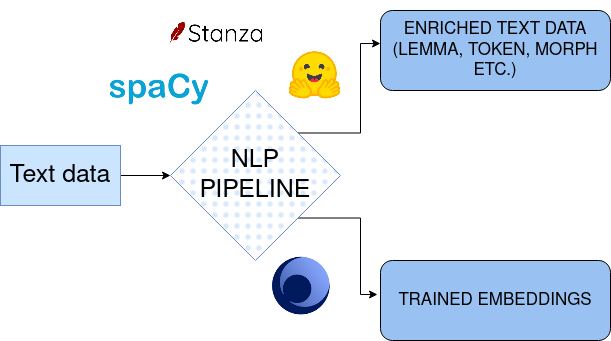

# nlp_pipeline



This repo is a wrapper of  different NLP libraries into a uniform pipeline object. That will make easy to use them all in one project or to compare them to each other.

You can use this pipeline to do the following:
- Tokenization
- Stemming
- Lemmatization
- POS tagging
- morphological analysis
- build embeddins on corpora

Now, the library that are supported are:
- [spaCy](https://spacy.io/)
- [stanza](https://stanfordnlp.github.io/stanza/)
- [huggingface](https://huggingface.co/)
- [gensim](https://radimrehurek.com/gensim/)


## Installation
1. Clone the repo
```bash
git clone  https://github.com/binbin83/nlp_pipeline.git
```
2. Create a virtual environment
```bash
python3 -m venv path/to/venv/nlp_pipeline
```
3. Install the requirements (if you wan to use gpu, install requirements_gpu.txt)
```bash
pip install -r requirements.txt
```
4. Read the Notebooks of examples in the folder notebooks
5. Update the config file with your own paths and parameters
6. Run the pipeline
```bash
python3 main_nlp.py
```
or

```bash
python3 main_embeddings.py
```


## NLP data

The pipelines:
- StanzaNlpPipeline
- SpacyNlpPipeline
- HuggingfaceNlpPipeline
- StanzaCoreNlpPipeline

Have nearly the same structure and the same methods. The results they return are the same. A dictionaries with the following keys:
- 'tokens': list of tokens
- 'lemmas': list of lemmas
- 'pos': list of pos tags
- 'morph': list of morphological analysis
- 'doc': the original doc object of the library

## Speed
With used RTX A4000 GPU 8Go, apply the nlp pipeline on  a 10 millions words corpus took:
- ~70 minutes for Stanza
- ~ xx minutes for Spacy trf

## Embeddings

The embeddings can be buil with the following models: Word2vec, Fastext, Doc2vec, LDA, LSA, ELDA, and HDP

## Todo

[ ] Add hugging models available  to the embeddings pipeline. ie make possible to finetune CAMEMBERT embeddings on the data

[ ] Add hops parser to the options: https://github.com/hopsparser/hopsparser

[ ] Add unitests


